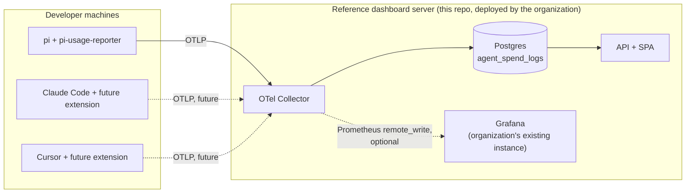
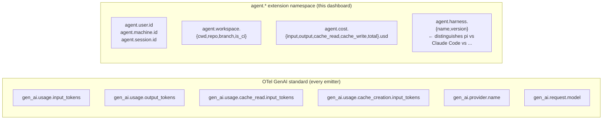

# agent-spend-dashboard

Per-developer LLM spend dashboard for coding-agent harnesses.

This repository is the **reference dashboard server** for the [scope-and-deployment strategy](https://github.com/vilosource/pi-extensions/blob/main/docs/strategy/scope-and-deployment-STRATEGY.md) (canonical version lives in [`vilosource/pi-extensions`](https://github.com/vilosource/pi-extensions)). It consumes [OpenTelemetry GenAI semantic conventions](https://opentelemetry.io/docs/specs/semconv/gen-ai/) plus a small `agent.*` extension namespace, and works with **any harness that emits OTel** — pi (via [`@vilosource/pi-usage-reporter`](https://github.com/vilosource/pi-extensions)), and in the future Claude Code, Cursor, Aider, or anything else that follows the same wire format.

## Status

**Lab + dashboards working.** The Compose stack (Postgres + OTel Collector + bridge + Grafana with three pre-built dashboards) and the synthetic emitter all live in this repo. End-to-end verified: `make lab && make seed` brings up a working local environment in under a minute and shows real graphs at <http://localhost:3000>.

What's not yet implemented:

- The pi-test container (§5 of the lab strategy) — next PR.
- Scenarios + `make e2e` (§9–10) — follow-up.
- The custom SPA + API (per-user RBAC, finance exports) — phase 0.3. Grafana covers the org/team views; the SPA covers the things Grafana can't.

## What's here today

- A [local lab strategy](docs/strategy/local-lab-STRATEGY.md) describing the Compose-based development environment, containerized pi target, scenario format, and CI integration
- A [public/private boundary strategy](docs/strategy/public-boundary-STRATEGY.md) and the same boundary CI as [`vilosource/pi-extensions`](https://github.com/vilosource/pi-extensions)
- A high-level design that mirrors the [pi-usage-reporter design](https://github.com/vilosource/pi-extensions/blob/main/docs/design/pi-usage-reporter-DESIGN.md) §4-§6 (Collector pipeline, Postgres schema, API + SPA scope)

Implementation lands as separate PRs on `main` once the lab strategy is reviewed.

## What this is not

This is **not** Optiscan's deployment of the dashboard. Optiscan's deployment lives in a private Optiscan-internal repo, fills in the organization-specific values (Docker Swarm stack, Azure Managed Postgres connection string, IdP issuer URL, real Grafana/Prometheus URLs), and is out of scope for this public repo.

This is also **not** the pi extension. The extension that emits OTel from a pi session lives at [`vilosource/pi-extensions`](https://github.com/vilosource/pi-extensions). The dashboard consumes what the extension emits; they are two artifacts with two release cycles.

## What you can do today

Run the lab:

```bash
make lab     # bring up Postgres + Collector + bridge + Grafana (~25s)
make seed    # emit ~2800 synthetic spans (~5s)
open http://localhost:3000   # browse the dashboards (anonymous viewer enabled)
make psql    # poke around the agent_spend_logs table
make clean   # tear everything down (irreversible)
```

Three dashboards are pre-loaded in the **Agent Spend** folder:

| Dashboard | Use it for |
|---|---|
| Org Overview | Org-wide cost, model mix, top spenders, metered-vs-subscription split |
| By Team | Per-team cost rollup, per-developer drill-down within team filter |
| Burn Rate | Real-time burn over the last 24 h; long-running session detector |

Log in as `admin` / `admin` to edit dashboards or add new ones (allowed in the lab; production deployments set a real password and disable anonymous viewing).

See `make help` for the full verb list. The lab uses defaults from `deploy/docker-compose/.env` (intentionally insecure placeholders for local development); a production deployment uses `compose.yml` alone with a real `.env`.

Read the docs:

| Path | Subject |
|---|---|
| [`docs/strategy/`](docs/strategy/) | Cross-cutting decisions for this repo |
| [`docs/design/`](docs/design/) | Per-component design docs (forthcoming) |
| [`docs/research/`](docs/research/) | Research briefs (forthcoming; some inherited via cross-link) |

## Architecture, in two diagrams

The big picture, from the perspective of a deploying organization:



The harness-agnostic attribute namespace, in one diagram:



## License

MIT — see [LICENSE](LICENSE).

## Contributing

See [CONTRIBUTING.md](CONTRIBUTING.md). For agents (human or AI) working in this repo, see [AGENTS.md](AGENTS.md).
