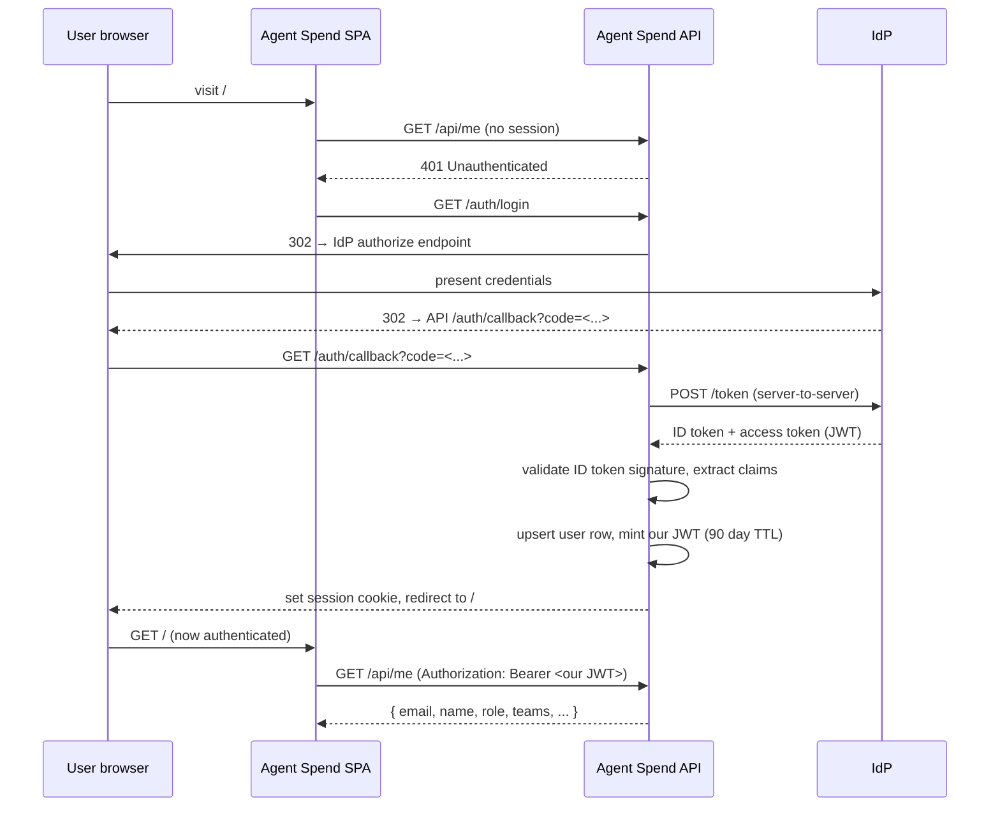
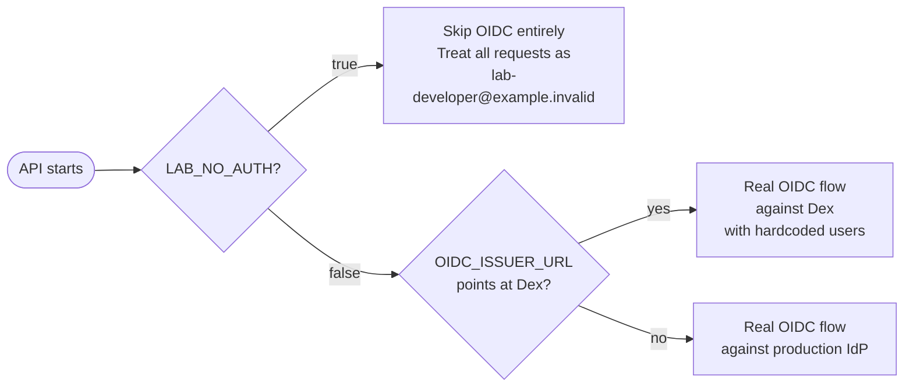
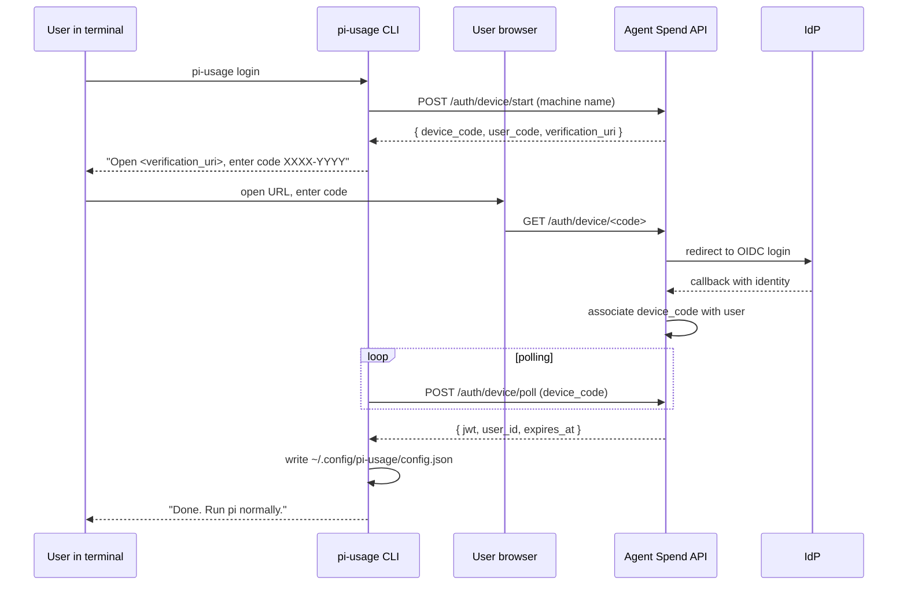

# Authentication Strategy

**Document type:** Strategy
**Status:** Accepted
**Date:** 2026-05-08
**Owner:** Platform / DevEx
**Related:** [`local-lab-STRATEGY.md`](local-lab-STRATEGY.md), [`scope-and-deployment-STRATEGY.md`](https://github.com/vilosource/pi-extensions/blob/main/docs/strategy/scope-and-deployment-STRATEGY.md), [`decisions-LOG.md`](decisions-LOG.md) (D7)

## 1. Decision

The reference dashboard server authenticates users via **OpenID Connect (OIDC)**. Any OIDC-compliant identity provider works without code changes — only environment variables differ between deployments. We support **Entra ID, Google Workspace, GitHub, Dex** as v1 first-class targets; any other OIDC IdP (Okta, Auth0, Keycloak, AWS Cognito, AWS IAM Identity Center, etc.) works the same way.

The lab uses **Dex** as a hardcoded mock IdP by default. A `LAB_NO_AUTH=true` escape hatch skips OIDC entirely for scripted runs and demos.

After OIDC callback, the API mints **its own JWT** scoped to the authenticated user. The IdP's tokens are not stored, refreshed, or reused. Per-machine tokens (one user → many machines, each independently revocable) are the model for pi extension auth.

This document records the auth model so it does not have to be re-litigated. The implementation lives in the API service per [`docs/design/api-and-spa-DESIGN.md`](../design/api-and-spa-DESIGN.md). Other future extensions (Claude Code, Cursor, etc.) reuse this same auth — that is why this doc is at the strategy level, not buried inside one component's design.

## 2. Why OIDC

OIDC is the standard auth protocol layered on OAuth 2.0. Every major IdP speaks it. Choosing OIDC means:

- **One code path serves every IdP.** A library (`openid-client` for Node) does discovery from the IdP's `.well-known/openid-configuration`, runs the Authorization Code Flow, validates the ID token. Our code receives `{ sub, email, name }` regardless of which IdP issued it.
- **Configuration is environment variables.** Three values pin the IdP: issuer URL, client ID, client secret. Different deploying organization → different env vars → different IdP. No application code changes.
- **Discovery handles upgrades.** When an IdP rotates signing keys or moves an endpoint, OIDC discovery picks it up automatically. We don't pin endpoint URLs.
- **GitHub is the only special case.** GitHub's OAuth predates OIDC and exposes a `/user` endpoint instead of issuing a proper ID token. We handle this with a small adapter (~30 LOC); every other supported IdP is plug-and-play OIDC.

## 3. The flow

The same flow runs against every supported IdP. Different IdPs differ only in the URL the user lands on between steps 3 and 5.



Three things to note:

1. **Our JWT is not the IdP's token.** We mint our own. This means our token survives the IdP being briefly unreachable (we validate signatures locally), and we have full control over revocation, expiry, and scope.
2. **Identity claims come from the IdP's ID token.** We trust `email` and `sub`; we never trust client-asserted identity (e.g. an extension claiming to be `alice@example.com` via env var).
3. **The session cookie holds the same JWT.** The browser uses the cookie; the extension uses the same JWT as a bearer token. One token, two transports.

## 4. Supported IdPs

### 4.1 Per-IdP configuration

The same three env vars (`OIDC_ISSUER_URL`, `OIDC_CLIENT_ID`, `OIDC_CLIENT_SECRET`) cover every IdP except GitHub. Concrete values per IdP:

| IdP | `OIDC_ISSUER_URL` | Notes |
|---|---|---|
| **Entra ID** (single tenant) | `https://login.microsoftonline.com/<tenant-id>/v2.0` | Tenant ID from Entra admin console. Recommended for organizations on Microsoft 365. |
| **Entra ID** (multi-tenant / personal) | `https://login.microsoftonline.com/common/v2.0` | Accepts any Microsoft account. Rarely the right choice for an internal tool. |
| **Google Workspace** | `https://accounts.google.com` | Restrict by `hd=<domain>` claim filter at the application layer. |
| **Okta** | `https://<org>.okta.com` | |
| **Auth0** | `https://<tenant>.auth0.com` | |
| **AWS Cognito** | `https://cognito-idp.<region>.amazonaws.com/<pool-id>` | |
| **AWS IAM Identity Center** (formerly AWS SSO) | `https://identitycenter.amazonaws.com/ssoins-<id>` | Good for organizations on AWS. |
| **Keycloak** (self-hosted) | `https://<host>/realms/<realm>` | Good for organizations that want to self-host the IdP. |
| **Dex** (lab / mock) | `http://idp:5556` | Used by the local lab. Hardcoded users; no signup. |
| **GitHub** | (not OIDC; uses OAuth 2.0) | See §4.2. |

### 4.2 GitHub special case

GitHub does not issue an ID token. After the OAuth code exchange, we call `https://api.github.com/user` to fetch the authenticated user, then map their `email` and `login` into our identity record.

The application config switches into GitHub mode via `OIDC_PROVIDER=github`:

```bash
OIDC_PROVIDER=github
GITHUB_CLIENT_ID=Iv1.<id>
GITHUB_CLIENT_SECRET=<from-secret-manager>
```

This is the only `if (provider === ...)` branch in the auth code. Every other IdP goes through the same OIDC code path.

### 4.3 Multiple IdPs in one deployment

Out of scope for v1. A single deployed instance speaks to exactly one IdP. If a deploying organization needs multiple identity sources (e.g. employees via Entra + contractors via GitHub), they run a federated IdP in front (Keycloak, Dex, or their existing Entra federation), and the API talks to that one IdP.

## 5. Lab modes

The lab supports three modes, switched by env var:



| Mode | Use case | How |
|---|---|---|
| **Dex (default)** | Daily developer work; CI scenarios that exercise the auth code path | Lab `compose.override.yml` sets `OIDC_ISSUER_URL=http://idp:5556`; Dex container has two static users (`lab-admin@example.invalid`, `lab-user@example.invalid`) |
| **`LAB_NO_AUTH=true`** | Scripted demos, smoke tests where the auth flow is incidental | API skips all auth; every request runs as `lab-developer@example.invalid`. Never used in production. |
| **Production OIDC** | Any deployed environment | `OIDC_ISSUER_URL`, `OIDC_CLIENT_ID`, `OIDC_CLIENT_SECRET` in env point at the deploying organization's IdP |

The default is **Dex with real OIDC** — this exercises the production code path in development, so OIDC bugs surface early. `LAB_NO_AUTH` exists as an explicit escape, not a default.

## 6. Token lifecycle

### 6.1 Browser session

After a successful login, the API:

1. Mints a JWT signed with `JWT_SECRET` (HS256). Claims: `sub`, `email`, `name`, `role`, `teams`, `iat`, `exp`.
2. Hashes the JWT with bcrypt; stores `(user_id, token_hash, name="browser-<short-id>", created_at, expires_at, last_seen_at)` in the `api_tokens` table.
3. Sets the JWT as an `HttpOnly`, `Secure`, `SameSite=Lax` session cookie.
4. The SPA includes the cookie automatically on every request.

Browser sessions are short — **24 hour TTL**. Refresh on activity. Re-prompts for login after a day of inactivity.

### 6.2 Per-machine pi extension tokens

When a developer clicks "Install on this machine" in the SPA, they name the machine and the API mints a separate, longer-lived JWT:

- Same JWT shape as the browser session, plus a `machine` claim.
- **90 day TTL** (configurable per deployment).
- Hashed and stored in `api_tokens` with `name="<machine-name>"`.
- Returned **once** in the install one-liner; never displayed again.

The Settings → Tokens page in the SPA lists every active token for the current user, with `name`, `created_at`, `last_seen_at`, and a Revoke button. Revoking sets `revoked_at` on the row; the API's auth middleware rejects any token whose hash matches a revoked row.

### 6.3 CI tokens

For CI runners, a developer or admin generates a long-lived token via the SPA, names it (`ci-runner`, `production-deploy`, etc.), and stores the value as a CI secret. The CI process sets `PI_USAGE_TOKEN=$AGENT_SPEND_CI_TOKEN` in its environment; the extension uses it as a bearer token. No browser ever opens.

### 6.4 Revocation

Three triggers, all of which set `revoked_at`:

1. **User-initiated** — the Revoke button on Settings → Tokens.
2. **Admin-initiated** — admin can revoke any user's tokens from the admin UI (used when someone leaves the company or a machine is stolen).
3. **Bulk** — `pi-usage logout` calls `DELETE /api/me/tokens/<id>` for the local machine's token.

The token's expiry is also a hard upper bound; expired tokens are auto-rejected even if `revoked_at` is null.

## 7. Identity model

### 7.1 Authoritative identity from JWT claims

**The user identity that lands in `agent_spend_logs.user_id` comes from the JWT signed by us, not from anything the extension's environment claims.** The extension cannot lie about who it is because:

1. The extension's outbound OTLP request includes `Authorization: Bearer <jwt>`.
2. The API verifies the signature with `JWT_SECRET`.
3. The API looks up the token row by hash; rejects if revoked or expired.
4. The API takes `user_id` from the JWT's `sub`/`email` claim, not from any `agent.user.id` attribute the extension sent.
5. If a row arrives at the API, its identity is ground truth.

This is a meaningful security improvement over the current state, where `agent.user.id` is whatever string the extension wrote (read from `git config user.email`). Today, anyone could forge any identity by setting `PI_USAGE_USER_ID`; under the new model, identity is asserted by the API.

### 7.2 What gets removed

Per D8 in the decisions log:

- The extension's `git config --global user.email` fallback is removed.
- `PI_USAGE_USER_ID` is no longer accepted (or accepted but ignored with a warning — TBD in the design).
- `~/.config/pi-usage/machine-id` stays — it's per-machine identity, not per-user identity, and useful for grouping a developer's many machines.
- The current `identity.ts` resolver simplifies to: read the token from `~/.config/pi-usage/config.json`; the API decodes the rest.

### 7.3 What `pi-usage login` actually does



This is the OAuth 2.0 Device Authorization Grant (RFC 8628) — the same flow `gcloud auth login` and GitHub's CLI use. It works on machines without a browser (CI, headless servers).

## 8. Privacy preview

Before a developer pastes the install one-liner, the SPA's Install page shows them what the extension will transmit:

```
When you run pi, this extension will send the following to <api-host>:
  ✓ Your identity (alice@example.com — confirmed via SSO)
  ✓ The model + provider for each turn
  ✓ Token counts and cost estimate
  ✓ The git repo and branch you're working in (or a hash if you opt in to redaction)
  ✗ Never: prompt content, tool arguments, file contents, shell output

Token will be valid for 90 days. You can revoke it at any time from
Settings → Tokens.
```

This is the privacy-by-design conversation made explicit before the install commits. It's a small piece of UI but a real trust signal — many enterprise telemetry tools obscure this and rely on the user reading the docs.

## 9. Decisions this document commits to

1. **OIDC for all authentication.** GitHub via OAuth 2.0 + `/user` adapter is the only exception.
2. **First-class IdPs at v1: Entra, Google, GitHub, Dex.** Any other OIDC-compliant IdP works without code changes (Okta, Auth0, Keycloak, Cognito, IAM Identity Center, etc.).
3. **Three lab modes:** Dex (default; exercises real OIDC), `LAB_NO_AUTH=true` (escape hatch), production OIDC. Default is Dex.
4. **API mints its own JWT** after OIDC callback. IdP tokens are not stored or reused.
5. **Identity comes from JWT claims**, not from anything the extension's environment asserts. Extensions cannot forge identity.
6. **Two TTLs: 24 h for browser sessions; 90 d for per-machine extension tokens.** Both revocable, both stored as bcrypt hashes.
7. **Per-machine tokens, not per-user tokens.** One user → many machines, each independently revocable. Settings → Tokens lists them with last-seen timestamps.
8. **The OAuth 2.0 Device Authorization Grant** (RFC 8628) is the auth path for `pi-usage login` from a terminal. Works on headless / CI machines.
9. **Privacy preview before install.** SPA shows what the extension will transmit before the user commits.
10. **`git config user.email` fallback in the extension is removed.** Identity comes from the token; the extension errors out clearly if no token is configured. (Recorded as D8 in the dashboard's decisions log and as D13 in the pi-extensions decisions log.)

