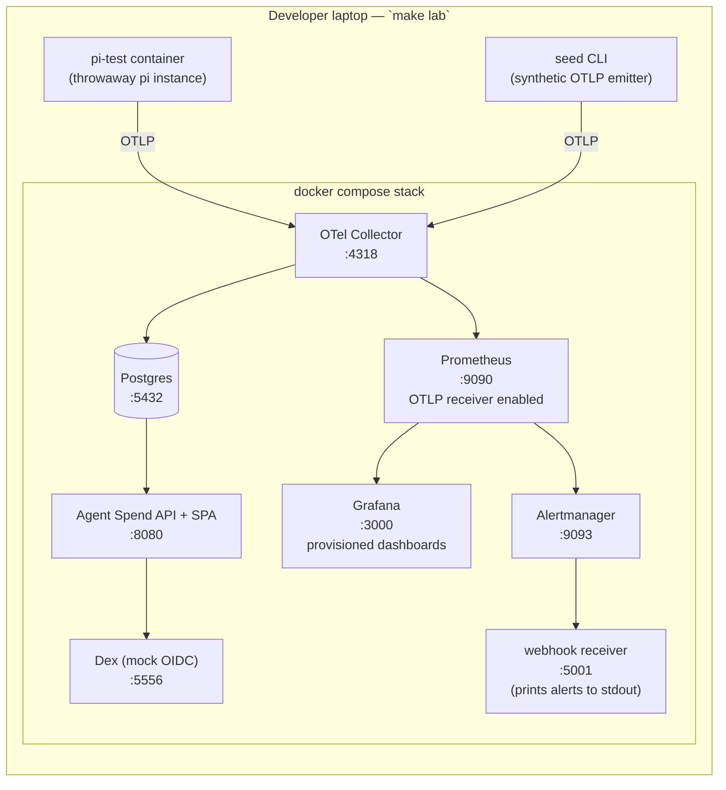
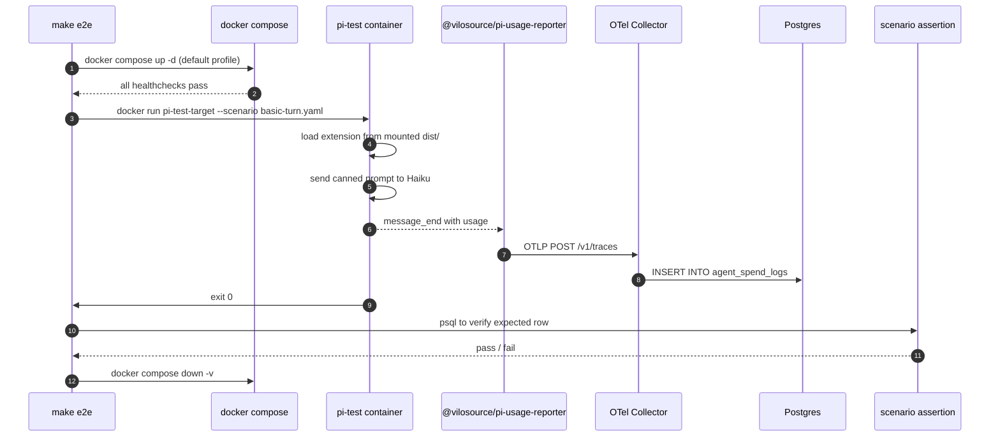
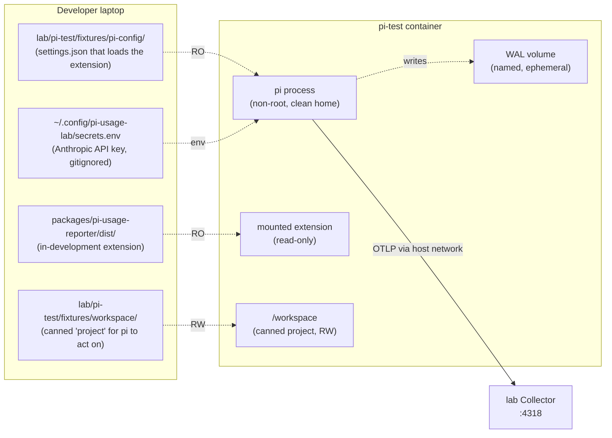
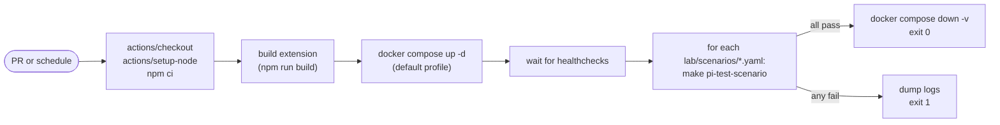
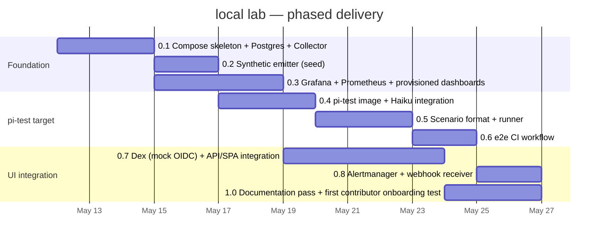

# Local Lab Strategy

**Document type:** Strategy
**Status:** Accepted
**Date:** 2026-05-08
**Owner:** Platform / DevEx
**Related:** [`scope-and-deployment-STRATEGY.md`](https://github.com/vilosource/pi-extensions/blob/main/docs/strategy/scope-and-deployment-STRATEGY.md), [`dashboard-backend-STRATEGY.md`](https://github.com/vilosource/pi-extensions/blob/main/docs/strategy/dashboard-backend-STRATEGY.md)

## 1. Decision

The reference dashboard server ships a **local lab** as part of the repository: a Docker Compose stack containing every component the server needs (OTel Collector, Postgres, Prometheus, Alertmanager, Grafana, the API, the SPA, a mock OIDC provider), plus a **containerized pi target** that loads the in-development pi extension and emits real OTLP events to the lab.

The lab serves three purposes simultaneously:

1. **A development environment** — contributors run `make lab` and can iterate on dashboard code with all backends live in seconds.
2. **A CI end-to-end test environment** — every PR runs `make e2e` which spins the lab, runs scripted scenarios against it, asserts on the resulting Postgres rows, and tears down.
3. **The "easiest path" production deployment recipe for small organizations** — the same Compose file (with `compose.override.yml` lifted) is what someone with one VM and no Kubernetes would use to actually run this.

This document specifies the lab. The lab itself ships in this repo as code (`deploy/docker-compose/`, `lab/`); this strategy doc records the decisions that shaped it so they don't have to be re-litigated.

## 2. Why a real lab matters more than usual here

The dashboard server is a multi-component system with no useful subset. You cannot meaningfully develop the API without Postgres; you cannot meaningfully test the OTLP receiver without something emitting real OTLP; you cannot validate Grafana dashboards without metrics flowing.

A laptop-local lab is the only sane way to iterate. **Without it, every change has a ten-minute test cycle (push → PR → CI → wait); with it, every change has a five-second test cycle (save → recompile → see result).** The difference is the difference between a project that gets built and a project that stalls.

The lab also doubles as the smallest viable production deployment recipe. An organization with one VM and Docker installed can run the same `compose.yml` (without the lab-only override file) and have a working dashboard. This is by design: writing the lab also writes the recipe.


## 3. Architecture

The lab is one Docker Compose stack. Two diagrams: components, and data flow during a typical run.

### 3.1 Components



### 3.2 Data flow during a scripted scenario



## 4. The Compose stack

### 4.1 Profiles map to backend shapes

Per the [dashboard backend strategy](https://github.com/vilosource/pi-extensions/blob/main/docs/strategy/dashboard-backend-STRATEGY.md), the dashboard supports three deployment shapes:

- **Shape 1** — Grafana stack only (Mimir/Tempo, ops view, no per-row RBAC)
- **Shape 2** — Postgres + custom SPA only (per-user, finance, audit)
- **Shape 3** — both (recommended for organizations with existing Grafana)

The lab supports flipping between them via Compose profiles, so a contributor can develop and test each shape:

| Compose service | Profiles |
|---|---|
| `collector` | always (every shape needs it) |
| `postgres` | `shape2`, `shape3`, `default` |
| `prometheus` | `shape1`, `shape3`, `default` |
| `alertmanager` | `shape1`, `shape3`, `default` |
| `grafana` | `shape1`, `shape3`, `default` |
| `api` | `shape2`, `shape3`, `default` |
| `idp` (Dex) | `shape2`, `shape3`, `default` |
| `webhook` | `shape1`, `shape3`, `default` |
| `seeder` | `seed` (manual invocation) |
| `pi-test` | `pi-test` (manual invocation) |

`make lab` (default) brings up Shape 3 (everything). `make lab SHAPE=1` brings up Shape 1 only. Same Compose file; no service duplication.

### 4.2 What's hardcoded in compose.yml vs. compose.override.yml

The strict separation:

- **`compose.yml`** is the **production-shaped** recipe. Every value that an organization would change is parameterized via env var (`${DATABASE_URL}`, `${OTEL_INGEST_TOKENS}`, `${PUBLIC_URL}`, `${OIDC_ISSUER_URL}`, etc.). No hardcoded credentials. No `localhost`. This is the file someone deploying on a single VM uses unmodified.
- **`compose.override.yml`** is **lab-only**. It hardcodes lab credentials (`POSTGRES_PASSWORD=dev`, `GF_SECURITY_ADMIN_PASSWORD=admin`), exposes ports to the host, mounts the in-development extension source, and adds the `pi-test` and `seeder` services. Compose loads it automatically alongside `compose.yml` when it's present in the working directory.

A small organization deploying to production:

```bash
cd deploy/docker-compose
rm compose.override.yml      # or just don't copy it
cp .env.example .env         # then edit .env with real values
docker compose up -d
```

Same file. No fork. The lab's `override.yml` is the only difference between "developer laptop" and "tiny production."

### 4.3 Concrete service list

Production-shaped services (`compose.yml`):

```
collector        ghcr.io/open-telemetry/opentelemetry-collector-contrib:latest
postgres         postgres:16-alpine
prometheus       prom/prometheus:latest
alertmanager     prom/alertmanager:latest
grafana          grafana/grafana-oss:latest
api              built from ../../  (when API code lands)
```

Lab-only services (`compose.override.yml`):

```
idp              ghcr.io/dexidp/dex:latest
webhook          ghcr.io/adnanh/webhook-tester:latest   (or a 30-line custom)
seeder           built from ../../lab/seed/
pi-test          built from ../../lab/pi-test/
```

### 4.4 Volumes and persistence

- Postgres data: named volume `pg-data`, wiped by `make reset`.
- Prometheus data: named volume `prom-data`, wiped by `make reset`.
- Grafana state: named volume `grafana-data`, wiped by `make reset`. Dashboards are *provisioned* (read from `deploy/docker-compose/grafana/provisioning/`), not stored in this volume — so wipes don't lose dashboard config.
- pi-test WAL: named volume `pi-test-wal`, separately wiped by `make pi-test-reset`.

Volumes are deliberately named (not anonymous) so they survive `docker compose down` but die on `docker compose down -v` (which `make reset` issues).


## 5. The containerized pi target

This is the second load-bearing piece of the lab. The poisoning problem it solves: when a developer iterates on the pi extension, every test run pollutes their real `~/.pi/agent/sessions/` with experimental data, attributes events to their real identity, and (worst case) emits to a staging or production endpoint by accident. A throwaway containerized pi makes every iteration clean.

### 5.1 Why a separate light image, not vafi's

Vafi (`vilosource/vafi`, the autonomous AI fleet platform) and vfa (its container runtime) already containerize pi for autonomous-agent use. We are not reusing their image because:

- Vafi's image is sized for autonomous fleet execution (controller loop, gate system, work-source abstraction). Our use case is "human types, pi responds, see what hooks fired." Different shape.
- Vafi's mount conventions are read-only by design; we need a writable WAL volume.
- Vafi pins specific pi-mono versions for fleet stability; the lab needs to test against latest pi-mono frequently.

Vafi serves as a **reference**, not a base image. From the mykb knowledge area for vafi/vfa we adopt:

- The mount-strategy pattern (RO source mount, RW workspace fixture, named volume for stateful data).
- The known gotcha: `vfa plugin mounts are always read-only (ReadOnly: true in pi.go BuildVolumes). Cannot use plugins for directories that need write access. ExtraVolumes field exists in profile schema but is not wired to Docker — silently ignored.` We will not make the same mistake; the WAL volume is a regular Docker volume mount, not a "plugin."
- The identity-injection-via-env-var pattern.

### 5.2 Image contents

`lab/pi-test/Dockerfile`:

```dockerfile
FROM node:22-bookworm-slim
RUN npm install -g @mariozechner/pi-coding-agent@latest
RUN useradd -m -u 1000 pitest && \
    mkdir -p /home/pitest/.pi /home/pitest/.cache /home/pitest/.config
USER pitest
WORKDIR /workspace
ENTRYPOINT ["pi"]
```

That's the whole image. No SSH keys, no git config, no API keys baked in. Identity and credentials come from the runtime environment.

### 5.3 Mount strategy



Key choices:

- **Extension source mounted RO from host build dir.** Developer rebuilds the extension (`tsc -b` in watch mode), the container picks up the new build on next invocation. No image rebuild between iterations.
- **Workspace is a canned fixture in `lab/pi-test/fixtures/workspace/`.** Tiny git repo with `package.json`, `README.md`, `agents.md`. Mounted RW into `/workspace`. Anything pi changes lives there and is wiped on reset.
- **WAL is a named Docker volume.** Reset wipes it: `docker volume rm pi-test-wal`.
- **Identity is fake by construction.** `PI_USAGE_USER_ID=lab-test@example.invalid`, `PI_USAGE_MACHINE_ID=00000000-0000-0000-0000-000000000001`, `PI_USAGE_ENVIRONMENT=lab`. The dashboard treats anything tagged `agent.environment=lab` as a separate dataset, filtered out of "real" views by default.
- **OTLP target is the lab Collector via the Compose network.** When invoked through `make pi-test` the container joins the lab's Compose network and reaches `http://collector:4318`.

### 5.4 LLM provider — real Haiku, not a mock

Per D5 in the [pi-extensions decisions log](https://github.com/vilosource/pi-extensions/blob/main/docs/strategy/decisions-LOG.md) and the conversation that produced this doc: we use **real Haiku** (Anthropic's cheapest model — roughly $0.80 / $4 per million tokens) for lab scenarios, not a mock provider.

Reasons:

- A typical scenario is a few hundred tokens; cost per scenario is fractions of a cent.
- Real provider path exercises the real `Usage.cost` calculation in pi-mono, which is exactly what we are validating.
- Mock providers introduce their own bugs and need their own maintenance.
- Non-determinism in response *content* doesn't matter — scenarios assert on token counts, cost shape, and attribute presence, not on response text.

Operational implications:

- The lab requires an Anthropic API key. Stored locally at `~/.config/pi-usage-lab/secrets.env` (gitignored), env-var injected into the `pi-test` container only. Never seen by the Collector or Postgres.
- CI requires the same. Stored as a GitHub Actions secret `ANTHROPIC_TEST_API_KEY`, scoped to a key with a low monthly cap (recommend $10 hard limit; Anthropic's console supports per-key caps).
- The lab Collector and Postgres see only the resulting OTLP events (tokens, cost, model name, etc.) — never the API key, never the prompt content.

### 5.5 Make verbs

```
make lab               # start the dashboard lab (default = Shape 3)
make lab SHAPE=1       # Shape 1 (Grafana only) variant
make lab SHAPE=2       # Shape 2 (Postgres only) variant
make lab-down          # stop, keep volumes
make reset             # docker compose down -v + start fresh + seed

make seed              # invoke synthetic OTLP emitter
make pi-test           # interactive pi shell in throwaway container
make pi-test-scenario S=basic-turn   # run a scripted scenario
make pi-test-shell     # bash shell in the pi-test container (debugging)
make pi-test-wal-cat   # dump WAL volume contents
make pi-test-reset     # wipe pi-test volumes, rebuild image

make e2e               # lab + pi-test + scenario + assertions + teardown
make e2e-clean         # full teardown of everything (used by CI on failure)

make logs S=collector  # docker compose logs -f for a service
make ps                # docker compose ps
```

`make` is intentional (not `just` or `task`): zero new tools to install, available on every developer machine.


## 6. Seed strategy

A new contributor running `make lab && make seed` should see populated dashboards in **under 30 seconds**. Two paths, used together:

### 6.1 Synthetic OTLP emitter (primary)

`lab/seed/synthetic-emit.ts` is a small Node script that emits realistic spans + metrics directly to the local Collector via OTLP/HTTP. It generates 7 days of traffic for ~10 fake users across ~5 fake teams using ~15 model variants (Opus / Sonnet / Haiku / GPT-5 / Gemini Pro / etc.).

Why synthetic-through-Collector and not SQL fixtures:

- Exercises the actual ingest pipeline (Collector receivers, processors, exporters) — so seed-time bugs surface seed-time, not later.
- Validates the Postgres schema, the team-lookup transform, and the Prometheus remote-write path in one motion.
- The data that lands in Postgres is *the same shape* as production data, generated by *the same code path*. SQL fixtures would diverge.

The emitter uses the same `agent.*` attribute namespace the production extension uses (per the [harness-agnostic strategy](https://github.com/vilosource/pi-extensions/blob/main/docs/strategy/decisions-LOG.md) D8), so dashboards designed against seeded data work without modification on production data.

Identity convention: synthetic users are `seed-user-1@example.invalid` through `seed-user-10@example.invalid`. They never collide with the pi-test container's `lab-test@example.invalid` or with any real user. The dashboard's default views filter by `agent.environment != 'lab'`; the seed and pi-test data show only when an explicit "lab data" filter is selected.

### 6.2 Optional real-pi tee (secondary)

For end-to-end validation of the actual extension code path, a developer can also run:

```bash
cd packages/pi-usage-reporter
PI_USAGE_ENDPOINT=http://localhost:4318 \
PI_USAGE_TOKEN=lab-token \
PI_USAGE_USER_ID=$(git config user.email) \
PI_USAGE_ENVIRONMENT=lab \
pi
```

Their own pi session emits to the lab Collector. Useful when the synthetic emitter and pi disagree on what attributes look like — the difference is the bug.

This path is documented but never the default: it requires the developer to consciously opt in.

## 7. The mock IdP

For SSO development without a real OIDC provider, the lab includes [Dex](https://dexidp.io/) as a Compose service. Dex is small (~30 MB image), boots in seconds, and is purpose-built for "local OIDC for a service to test against."

Configuration in `lab/idp/dex-config.yaml`:

- One static client: `client_id=agent-spend`, `client_secret=lab-secret`, redirect URI `http://localhost:8080/auth/callback`.
- One static user: email `lab-admin@example.invalid`, password `admin`, claims `{ "team": "platform", "role": "admin" }`.
- One additional user: `lab-user@example.invalid` / `user`, `{ "team": "platform", "role": "developer" }`.

The API service in the lab is configured with `OIDC_ISSUER_URL=http://idp:5556` (Compose-network DNS), `OIDC_CLIENT_ID=agent-spend`, `OIDC_CLIENT_SECRET=lab-secret`. The user logs into the SPA in their browser, gets bounced through Dex, lands back in the SPA authenticated as either admin or developer — exercising the full RBAC code path.

Dex is **lab-only**. Production deployments use Entra / Google / Okta / Auth0 / Keycloak / their own Dex / etc. — anything OIDC-compliant. The `compose.yml` doesn't include Dex; only `compose.override.yml` does.

## 8. Privacy and the boundary

The lab is subject to the same [public-boundary](public-boundary-STRATEGY.md) rules as the rest of the repo. Specifically:

- Lab credentials are conventional placeholders, not secrets. `dev/dev`, `admin/admin`, `lab-secret`, `00000000-0000-0000-0000-000000000001`. None are real anywhere.
- All identities use IETF-reserved domains: `.example.invalid`, `.example.com`, `.test`. `lab-test@example.invalid`, `seed-user-N@example.invalid`, `lab-admin@example.invalid`.
- All hostnames in lab config are `localhost` or Compose service names (`collector`, `postgres`, `idp`). No real FQDNs.
- The `~/.config/pi-usage-lab/secrets.env` file containing the Anthropic API key is **gitignored at the repo root**. The `.gitignore` is updated to include it explicitly.
- The CI Anthropic key is a GitHub Actions secret with a low monthly spending cap.

The boundary check (`scripts/check-public-boundary.sh`) runs against the lab files just like any other source. Lab files use placeholders by construction.


## 9. Scenario format for end-to-end tests

Scenarios are YAML files in `lab/scenarios/`, run by `make pi-test-scenario S=<name>`. Each scenario specifies:

- **identity** to inject into the pi-test container
- **provider config** (Haiku endpoint + key from secrets.env)
- **prompts** to send to pi
- **expected** Postgres rows after the run

Example `lab/scenarios/basic-turn.yaml`:

```yaml
name: basic-turn
description: One user message, one assistant response, verify spend log row.
identity:
  user_id: lab-test@example.invalid
  machine_id: 00000000-0000-0000-0000-000000000001
  environment: lab
provider:
  type: anthropic
  model: claude-3-5-haiku-latest
prompts:
  - "Reply with exactly the word 'ok'."
expect:
  postgres_query: |
    SELECT count(*) FROM agent_spend_logs
    WHERE user_id = 'lab-test@example.invalid'
      AND environment = 'lab'
      AND ingest_ts > now() - interval '1 minute'
  rows: 1
  attributes_present:
    - gen_ai.usage.input_tokens
    - gen_ai.usage.output_tokens
    - agent.cost.total.usd
    - agent.harness.name
    - agent.harness.version
  attributes_constraints:
    agent.harness.name: pi
    gen_ai.provider.name: anthropic
```

The scenario runner (`lab/scenarios/run.ts`) is ~150 LOC: read YAML, set env vars, spawn pi-test, wait for exit, run psql query, assert. Failures print which expectation failed and what was found instead.

Scenarios are versioned with the dashboard server. Adding a new dashboard feature without adding (or updating) a scenario is a code review red flag.

## 10. CI integration

GitHub Actions `e2e.yml` runs on every PR and nightly:



Estimated runtime: 90 seconds startup + 15 seconds per scenario + 10 seconds teardown. With ~5 initial scenarios, total ~3 minutes per PR. Not free but not painful.

Anthropic API key is the GitHub Actions secret `ANTHROPIC_TEST_API_KEY`, scoped per environment (separate keys for `pull_request` vs `push: main`), each with a low monthly cap.

## 11. What this lab is not

To bound the scope and resist creep:

- **Not a load test environment.** The lab runs at developer-laptop scale (2 collector replicas, 1 Postgres, etc.). Performance testing is a separate concern with its own setup.
- **Not a security test environment.** The lab uses dev credentials and disabled TLS for ergonomics. Security scans and pentests target production deployments.
- **Not a multi-tenant test environment.** v1 is single-tenant. Multi-tenant scenarios will get their own separate scenario suite when the schema starts caring.
- **Not a UI test environment.** Selenium / Playwright tests for the SPA live in their own directory (`spa/test/e2e/`) and run in their own CI job, against the lab API but with their own assertion style. Out of scope here.
- **Not a Kubernetes deployment recipe.** That lives in `deploy/helm/` (when it exists), separate from `deploy/docker-compose/`. The lab is Compose-only.

## 12. Phased lab delivery

The lab itself is built in phases, each unblocking dashboard development for that shape:



Phases 0.1-0.3 unblock dashboard server development (server can be coded against real Postgres + real Grafana from day one). Phases 0.4-0.6 unblock pi extension iteration and CI. Phases 0.7-1.0 polish the experience.

## 13. Decisions this document commits to

1. **The lab lives in this repo at `deploy/docker-compose/` and `lab/`.** It is not a separate repo. The `compose.yml` doubles as the smallest viable production recipe; `compose.override.yml` adds the lab-only ergonomics.
2. **Compose with profiles, Makefile wrapper.** No `just`, no `task`, no Nx — keep tools to what is on every developer machine.
3. **One containerized pi target image** (`lab/pi-test/`), purpose-built for our test scenarios, **not** a base of vafi's image. Vafi as reference only.
4. **Real Haiku for scenarios**, not a mock provider. Anthropic API key from `~/.config/pi-usage-lab/secrets.env` locally and `ANTHROPIC_TEST_API_KEY` in CI, both with low spending caps.
5. **Dex** as the mock OIDC IdP. Production deployments substitute Entra/Google/Okta/Auth0/Keycloak via env vars.
6. **Synthetic OTLP emitter** as the primary seed path; optional real-pi tee as a documented secondary path.
7. **Scenarios are YAML in `lab/scenarios/`** with a small TypeScript runner. Postgres assertions only (not Prometheus / Grafana — those are downstream of Postgres anyway).
8. **e2e in CI on every PR + nightly.** Estimated 3 minutes per PR.
9. **Lab identities use IETF-reserved domains** (`example.invalid`, `example.com`, `test`). No real values anywhere.
10. **The lab is bounded by what it is not** (§11). Performance, security, UI, and Kubernetes test environments are separate concerns and will land in their own places when needed.

## 14. Pi-mom

Pi-mom support is out of scope for v1, per [D7 in the pi-extensions decisions log](https://github.com/vilosource/pi-extensions/blob/main/docs/strategy/decisions-LOG.md). The lab does not include a pi-mom container. If pi-mom is ever loaded with `@vilosource/pi-usage-reporter`, spend will be attributed to whatever `PI_USAGE_USER_ID` resolves to inside the mom container — same code path, no special handling.

When and if pi-mom support becomes a real need, the lab gains `lab/mom-test/` mirroring `lab/pi-test/` with a Slack mock. Until then, deferred.
